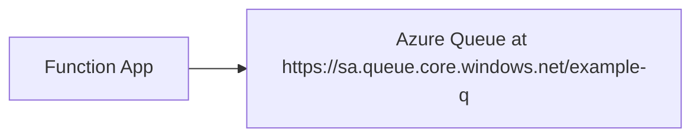
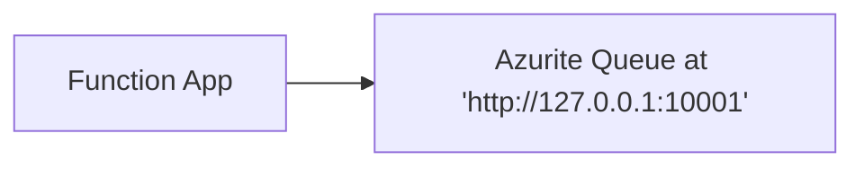
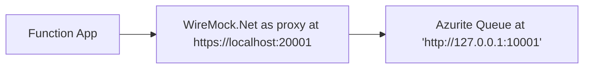
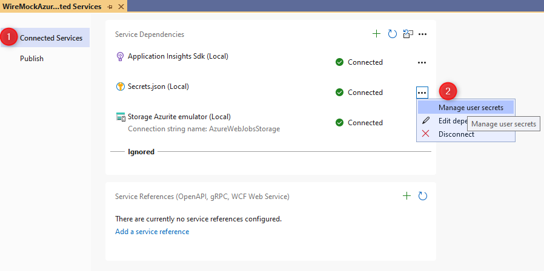
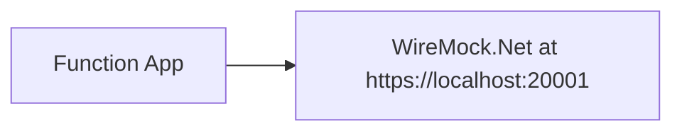
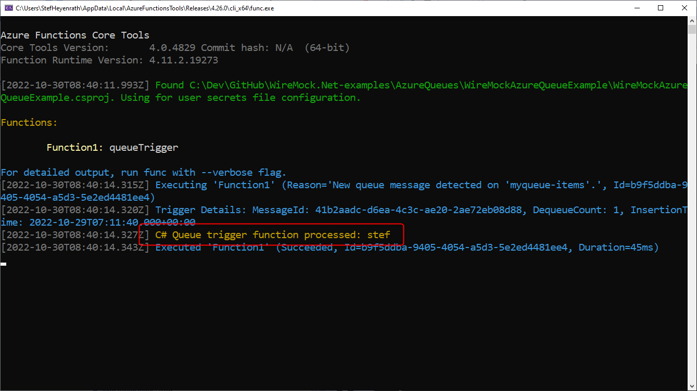

# WireMock.Net-examples

## WireMock.Net + Azure Queue Example


### :one: Normal configuration (connecting to Azure)

<div class="left">



</div>

### :two: Local configuration (connecting to [Azurite](https://learn.microsoft.com/en-us/azure/storage/common/storage-use-azurite?tabs=visual-studio))

<div class="left">



</div>

### :three: Local configuration (connecting to WireMock.Net in *Proxy*-mode)

In this step WireMock.Net is configured to act as a proxy to capture all requests which are send by the Azure Function to the local Azurite Queue.

<div class="left">



</div>

#### A. Configure WireMock.Net to act as a proxy (running at https://localhost:20001)
``` c#
var server = WireMockServer.Start(new WireMockServerSettings
{
    Logger = new WireMockConsoleLogger(),
    Urls = new[] { "http://localhost:20001/" }, // ⭐ WireMock.Net listens at port 20001
    StartAdminInterface = false,
    ReadStaticMappings = true,
    WatchStaticMappings = true,
    WatchStaticMappingsInSubdirectories = true,
    ProxyAndRecordSettings = new ProxyAndRecordSettings
    {
        Url = "http://127.0.0.1:10001", // ⭐ All calls are forwarded to the real Azurite instance
        SaveMapping = true,
        SaveMappingToFile = true,
        AppendGuidToSavedMappingFile = true
    }
});
```


#### B. Configure your Azure Function to connect to WireMock.Net

Go to "Connected Services" <sup>(1)</sup> and "Manage user secrets" <sup>(2)</sup>.


Update the secrets so that the Azure Function connects to  the WireMock.Net instance
**secrets.json**
``` json
{
  "ConnectionStringToWireMock": "DefaultEndpointsProtocol=http;AccountName=devstoreaccount1;AccountKey=Eby8vdM02xNOcqFlqUwJPLlmEtlCDXJ1OUzFT50uSRZ6IFsuFq2UVErCz4I6tq/K1SZFPTOtr/KBHBeksoGMGw==;BlobEndpoint=http://127.0.0.1:10000/devstoreaccount1;QueueEndpoint=http://127.0.0.1:20001/devstoreaccount1;TableEndpoint=http://127.0.0.1:10002/devstoreaccount1;",
  "ConnectionStringToWireMock:blob": "http://127.0.0.1:10000/devstoreaccount1",
  "ConnectionStringToWireMock:queue": "http://127.0.0.1:20001/devstoreaccount1"
}
```

#### C: Start the Azure Function
Now start your Azure Function, place some messages on the Queue and test that everything works.

Because WireMock.Net is now running in proxy-mode, all calls are saved in the `\bin\__admin\mappings` folder.

Multiple mapping files are saved, however there ar only 4 different important messages:

1. HEAD : `/_devstoreaccount1/myqueue-items`
2. GET : `/_devstoreaccount1_myqueue-items` (results in no messages)
3. GET : `/_devstoreaccount1_myqueue-items` (results in 1 message)
4. DELETE : `/_devstoreaccount1/myqueue-items/messages/{message-id}`


### :four: Local configuration (connecting to WireMock.Net)

In this step WireMock.Net is configured to use the mappings to *act* as Azure Queue so that the Azure Function can work correctly.

<div style="align: left">



</div>

#### A. Update the mapping files
Edit the mapping files (.json) which are generated to keep 4 unique:
1. HEAD : `/_devstoreaccount1/myqueue-items`
2. GET : `/_devstoreaccount1_myqueue-items` (results in no messages)
3. GET : `/_devstoreaccount1_myqueue-items` (results in 1 message)
4. DELETE : `/_devstoreaccount1/myqueue-items/messages/{message-id}`

And make sure that the mapping file is correct (like matching on the correct request) and returning a correct response.

An example for the `HEAD` mapping looks like this:
``` json
{
    "Guid": "17c7a389-98e1-4383-975d-54c82d1e3860",
    "Title": "Proxy Mapping for HEAD /devstoreaccount1/myqueue-items",
    "Description": "Proxy Mapping for HEAD /devstoreaccount1/myqueue-items",
    "Request": {
        "Path": {
            "Matchers": [
                {
                    "Name": "WildcardMatcher",
                    "Pattern": "/devstoreaccount1/myqueue-items",
                    "IgnoreCase": false
                }
            ]
        },
        "Methods": [
            "HEAD"
        ],
        "Params": [
            {
                "Name": "comp",
                "Matchers": [
                    {
                        "Name": "ExactMatcher",
                        "Pattern": "metadata",
                        "IgnoreCase": false
                    }
                ]
            }
        ]
    },
    "Response": {
        "StatusCode": 200,
        "Headers": {
            "Server": "Azurite-Queue/3.19.0",
            "x-ms-client-request-id": "{{request.headers.x-ms-client-request-id}}",
            "x-ms-approximate-messages-count": "0",
            "x-ms-request-id": "{{Random Type=\"Guid\"}}",
            "x-ms-version": "2021-10-04",
            "Date": "{{DateTime.Now \"ddd, dd MMM yyy HH’:’mm’:’ss ‘GMT’\"}}",
            "Connection": "keep-alive",
            "Keep-Alive": "timeout=5"
        },
        "UseTransformer": true
    }
}
```

For more mappings used as example, see [AzureQueues/WireMockAzureQueueProxy/__admin/mappings](https://github.com/WireMock-Net/WireMock.Net-examples/tree/main/AzureQueues/WireMockAzureQueueProxy/__admin/mappings)


#### B. Configure WireMock.Net to act as *stub* (running at https://localhost:20001)
``` c#
var server = WireMockServer.Start(new WireMockServerSettings
{
    Logger = new WireMockConsoleLogger(),
    Urls = new[] { "http://localhost:20001/" }, // ⭐ WireMock.Net listens at port 20001
    StartAdminInterface = false,
    ReadStaticMappings = true,
    WatchStaticMappings = true,
    WatchStaticMappingsInSubdirectories = true
});
```


#### C. Start and test your Azure Function

Start and test your Azure Function.



Done...